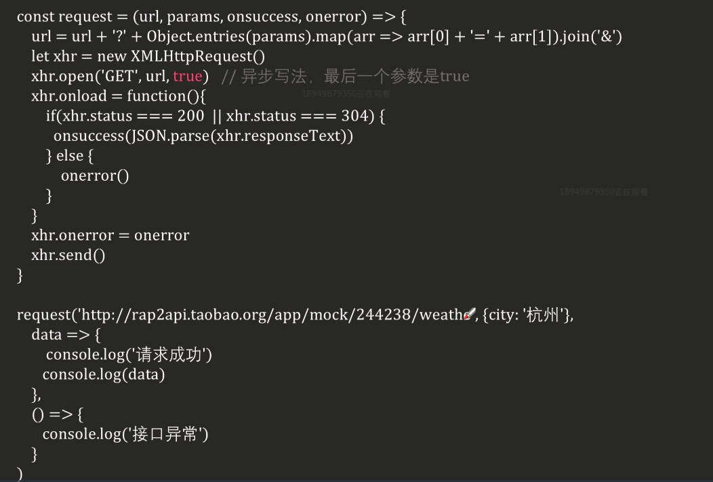
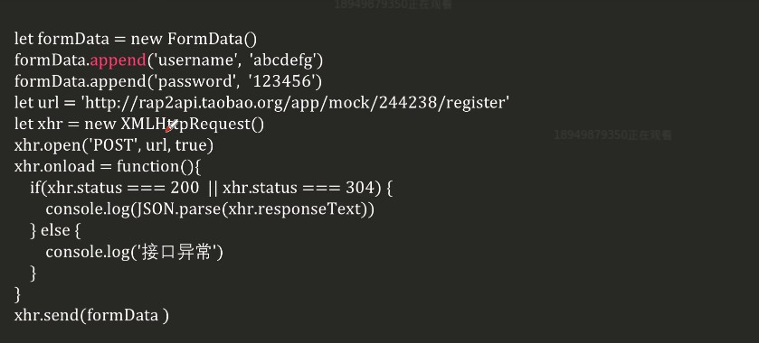
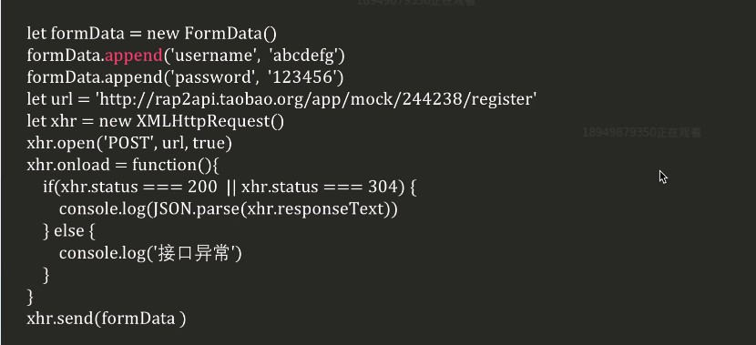

# 前后交互

三种方式

1. form
2. ajax
3. websock


## form

- 仅支持GET和POST
- 缺点 : 页面会刷新 , 导致用户体验不好


## ajax

- async  javaScript and xml
  - 使用内置的XMLHttpRequest 和 fetch 对象
  - 实现前后交互
- 优点 ; 交互时页面不刷新


## websock

可以由服务器端主动发起


# XMLHttpRequest的使用

## 发送get请求

1. 创建对象
2. 配置参数
3. 绑定事件
4. 发送请求

```js
let xhr = new XMLHttpRequset()
xhr.open('GET',url,true)
xhr.onload = function() {
    
}
xhr.send()
```


## 新版写法


## 发送POST请求


分析 : 

post请求 , 是向服务器发送数据

1. 告诉服务器 string的格式

```js
xhr.setRequsetHeader("Content-type","xxx")
```

2. 设置超时时间 , 用来判断数据是否发送成给了

```js
xhr.timeout = 3000
xhr.ontimerout = ()=>{ }
```

3. 设置请求体

```js
xhr.send("请求体的内容")
```


# xhr对象的重要细节

## 同步 vs 异步

- open(method,url,Boolean)
  - 第三个参数:表示是同步还是异步请求
  - 同步 : false  -- 表示程序会在ajax对象这里等很久 , 后面的代码不会去执行
  - 异步 : true -- 表示不等待


## 封装




## post请求编码方式

- 告诉服务器请求参数的编码方式

```js
req.setRequsetHeader("Content-Type","application/x-wwww-form-urlencoded";character="utf-8")
```

- multipart/form-data




## post登录验证

方式一




方式二

[登录案例](http://js.jirengu.com/suhuha/edit?css,js,output)


# fetch的简单使用

```js
let url = "xxxx"
fetch(url).then(res=>res.json())
.then(data=>{
    document.body.innerText = data.results[0]
})
```


- fetch是一个内置包装了Promise的对象
- 可以直接调用Promise的api
- … 具体看  fetch  mdn


# 双工通讯

## Ajax轮询实现

- 每隔固定时间发一次请求
- 以聊天室案例说明 : 
  - 就是客户端不停的向服务器发送ajax请求
  - 很消耗性能


## 长轮询

上一种方法的问题就是 : 每隔**固定**时间发送,消耗性能 , 也太死板了

现在解决固定这个问题

- 客户端
  - 等到服务端响应数据时再次发送请求
  - 确认收到数据了, 才发请求
- 服务端
  - 没有newData , 不对请求做出响应


